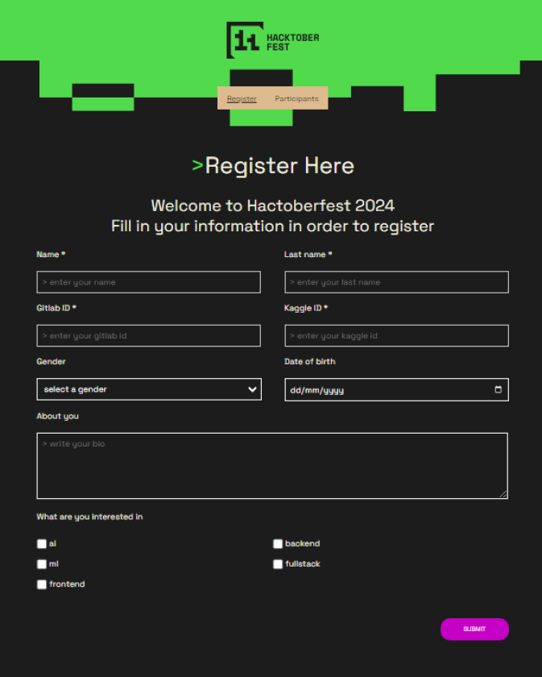
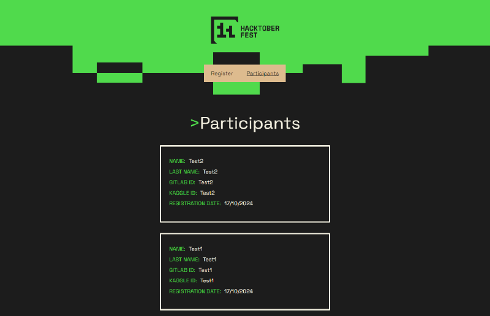

# Hacktoberfest 2024 Web Application in React & MySQL

## Prerequisites

To run this project, you will need the following:

- **Node.js**: Ensure that Node.js is installed on your computer.
- **VSCode or another IDE**: To run and modify the project.
- **MySQL Database Management**: You will need a tool to manage MySQL databases, such as XAMPP or any other MySQL-compatible tool.

## Installation and Starting the Database

### Using XAMPP

If you are using XAMPP:
1. Open XAMPP.
2. Click the **Start** button for the MySQL module.

If you are using another MySQL application, ensure the MySQL service is active.

## Steps to Run the Project

### Setting Up the API Server

1. Open a terminal in the project's root folder.
2. Run the following commands in sequence:

    ```bash
    cd api
    npm install
    npm start
    ```

   This will install the necessary dependencies for the API and start the API server.

### Setting Up the Client (React Frontend)

1. Open a second terminal in the project's root folder.
2. Run the following commands:

    ```bash
    cd client
    npm install
    npm start
    ```

   This will install the dependencies for the frontend and start the React application.

Following these steps, the project should run without any issues.



